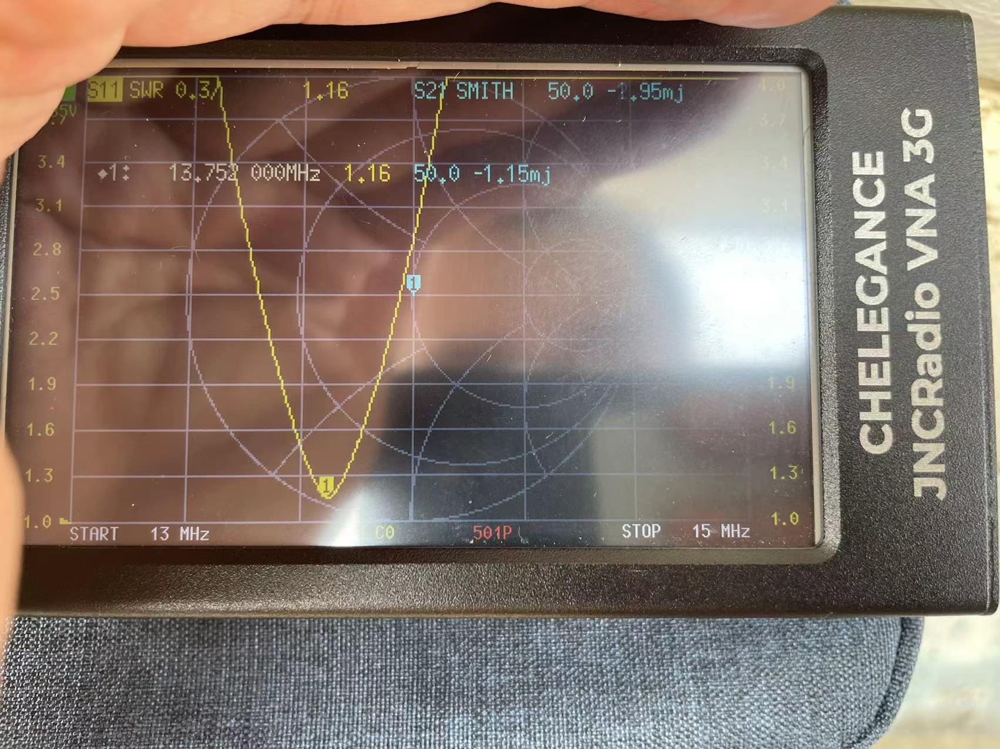

# Set my M-104 on a roof

Today i'm setting up my M-104 antenna on the roof.

There are many ways to set it up but today i used it as a portable GP, vertical polarized.

I used a clamp and mount the base to a railing.

M-104 does require a good counterpoise, i used the ring terminal comes with M-104 and put it to the base.

I used one of the 'banana wire' radials from [MC-750 antenna](https://chelegance.com/product/jncradio-mc-750-100-watts-portable-hf-gp-antenna/)
>Above 14MHz at least 1 radial is required, more than 3 is recommended for 7MHz.

Put the radial to the ring terminal and now it acted as my M-104 antenna counterpoise.

It's now time to tune the resonant frequency. Hooked the antenna up to my [JNCRadio VNA 3G](https://chelegance.com/product/jncradio_vna_3g/) and i figured my antenna now is resonance at 13.752MHz. (Just look at the SWR readings and Ignore the SmithChart readings as i made a mistake by choosing S21 instead of S11)

As i'm aiming around 14.2xxMHz, I shortened my antenna a little bit and read 14.036 - getting closer.

Shortened a little bit further and i saw what i expected

 Antenna was set. Time to start QSOs!
