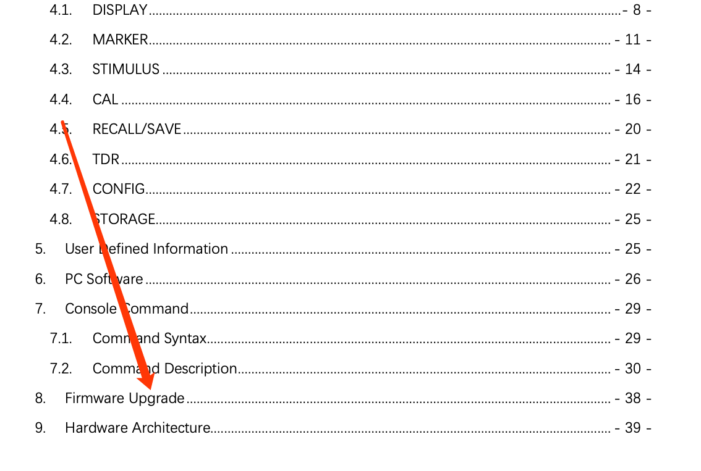
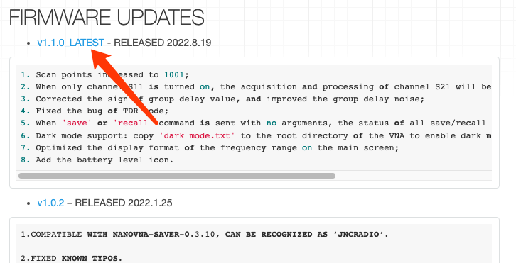
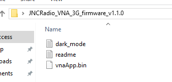
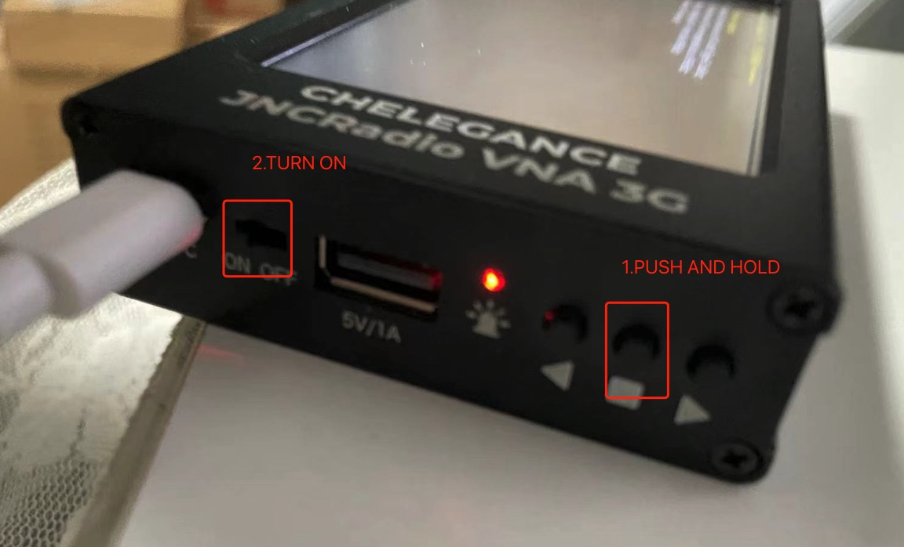
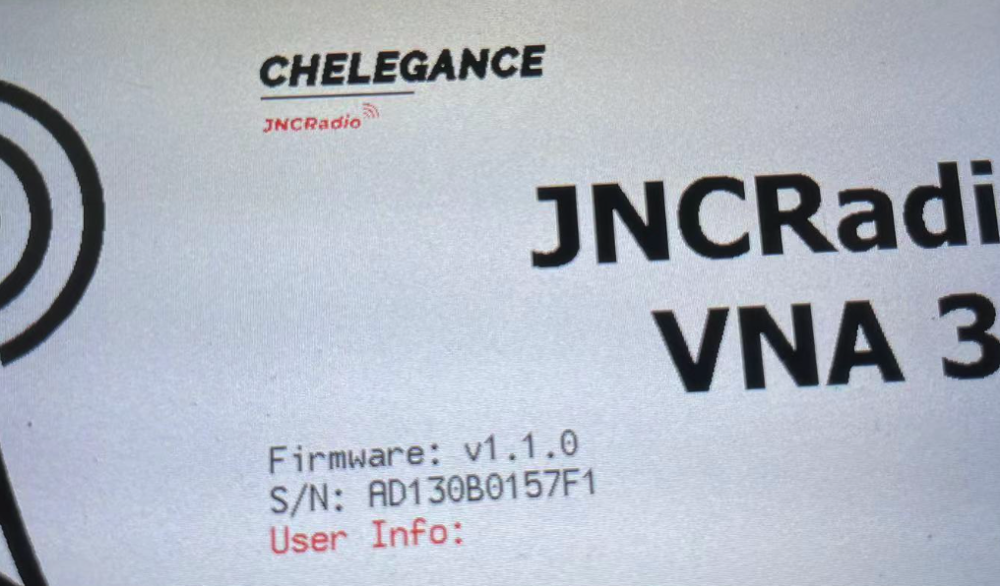

# JNCRADIO VNA 3G UPGRADE FIRMWARE

* The firmware upgrade tutorial is well explained in the user manual section 8, as below -



* As the user manual says, what we need to do is to

```
Firmware upgrade:
1.Connect the device to PC with Type-C cable;
2.The device will be recognized as a U-Disk;
3.Copy ‘vnaApp.bin’ into the U-Disk;
4.Power off and on;
```

## DOWNLOAD THE LATEST FIRMWARE

* Firmwares will be available from [Chelegance wiki page](https://chelegance.github.io/WIKI/), navigate to JNCRadio vna 3g product page and find the latest firmware available(up to date of this article is v1.1.0).



* Download and unzip it. It will be a folder with a .bin file in it.



## UPGRADE Firmware

* Connect the VNA to your computer with supplied type-c CABLE

* Push and hold the middle push button, then power on JNCRadio VNA 3G. It will be recognized as a U-disk from your computer



* Drag the .bin file to the root directory of the U-disk(replace if there's previous version)

* Eject the VNA from your computer and restart your VNA.

* Succeed!


